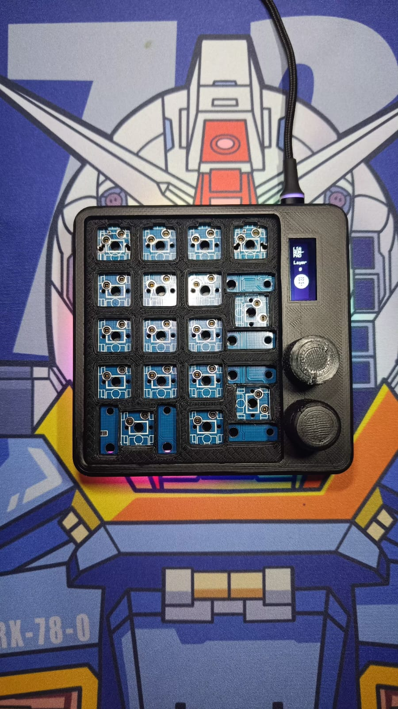
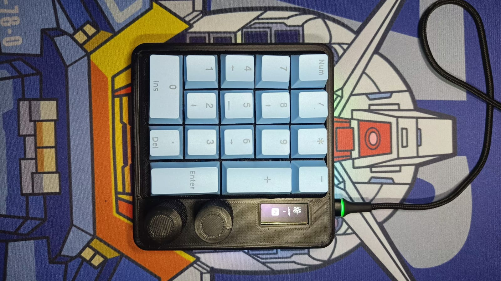
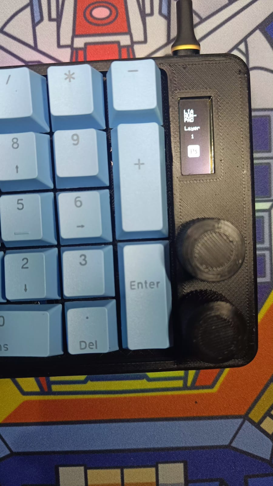
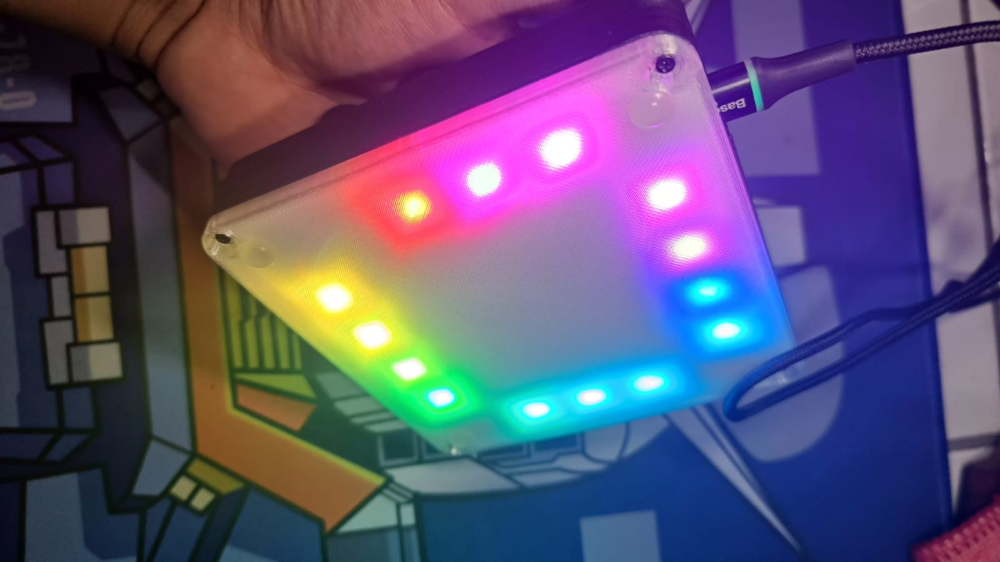
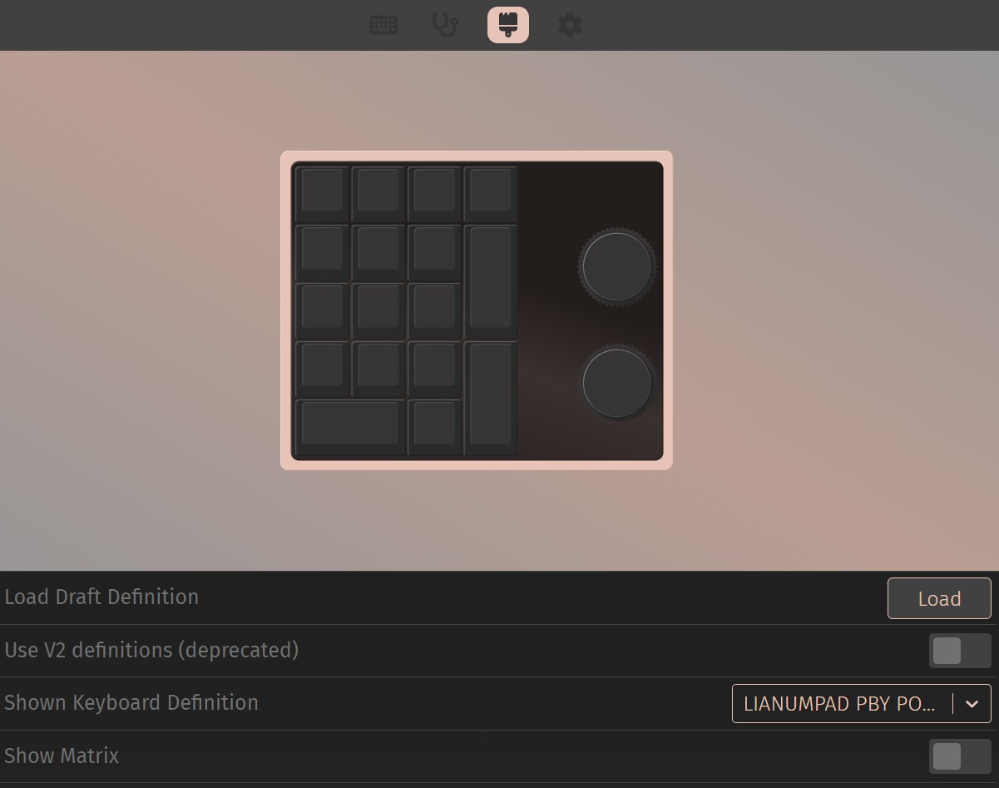

# Lianumpad-QMK-VIA

## Spesification
- STM32F401 as Microcontroller
- QMK Firmware
- Support VIA, all key and knob can proggrammed
- RGB Underglow
- OLED 
- Numpad Layout
- Hotswap Switch
- 2x Encoder Knob
- 3D Case 

## Preview Hardware

  
  
  
  
  

## Preview VIA

  
  

https://github.com/juarendra/Lianumpad-QMK-VIA/assets/43043633/17dc67bd-2fdd-4909-9ca9-a61d3f643179

