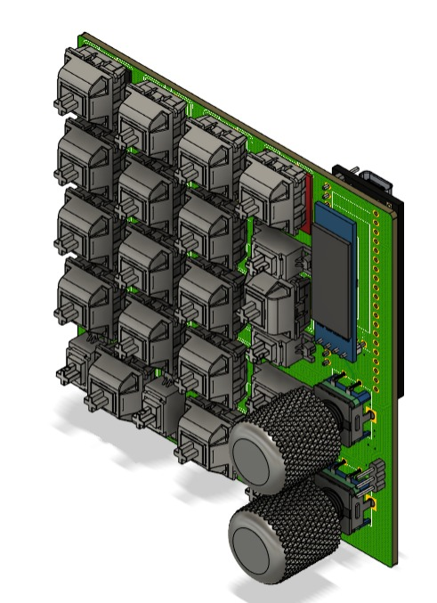

# Lianumpad-QMK-VIA

## Spesification
- STM32F401 as Microcontroller
- QMK Firmware
- Support VIA, all key and knob can proggrammed
- RGB Underglow
- OLED 
- Numpad Layout
- Hotswap Switch
- 2x Encoder Knob
- 3D Case 

## Preview Hardware

  
  
  
  
  

## Preview VIA

  
  

Uploading lianumpad_via.mp4…

